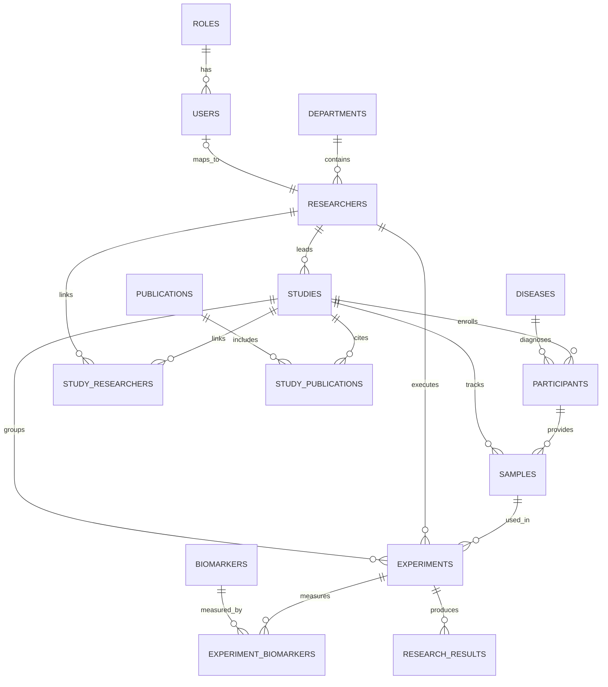

# ER Diagram (MedResearchVault)

```mermaid
erDiagram
  ROLES ||--o{ USERS : has
  DEPARTMENTS ||--o{ RESEARCHERS : contains
  USERS o|--|| RESEARCHERS : maps_to
  RESEARCHERS ||--o{ STUDIES : leads
  STUDIES ||--o{ PARTICIPANTS : enrolls
  DISEASES ||--o{ PARTICIPANTS : diagnoses
  PARTICIPANTS ||--o{ SAMPLES : provides
  STUDIES ||--o{ SAMPLES : tracks
  STUDIES ||--o{ STUDY_RESEARCHERS : links
  RESEARCHERS ||--o{ STUDY_RESEARCHERS : links
  SAMPLES ||--o{ EXPERIMENTS : used_in
  RESEARCHERS ||--o{ EXPERIMENTS : executes
  STUDIES ||--o{ EXPERIMENTS : groups
  EXPERIMENTS ||--o{ EXPERIMENT_BIOMARKERS : measures
  BIOMARKERS ||--o{ EXPERIMENT_BIOMARKERS : measured_by
  EXPERIMENTS ||--o{ RESEARCH_RESULTS : produces
  STUDIES ||--o{ STUDY_PUBLICATIONS : cites
  PUBLICATIONS ||--o{ STUDY_PUBLICATIONS : includes
```
